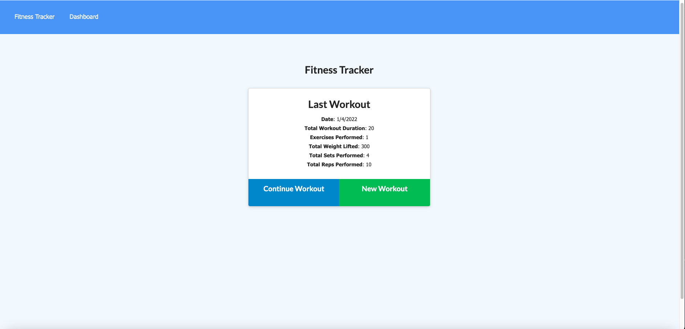
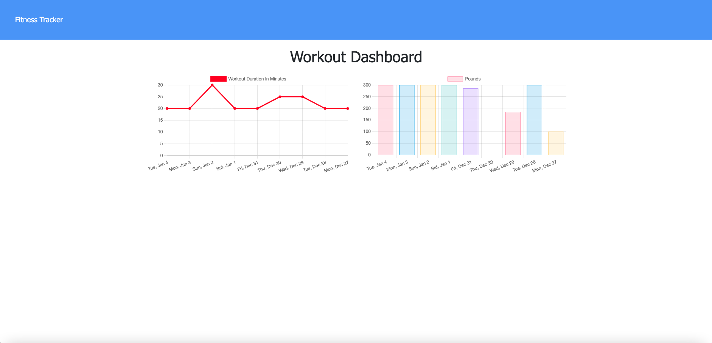

# Fitness Tracker
This is fitness tracker application that will track workout you have performed and completed. On the dashboard it will measure out your progress so the user can visualize their improvements.
<!-- > Outline a brief description of your project. -->
> Live demo [_here_](https://www.example.com).  <!--If you have the project hosted somewhere, include the link here. -->

## Table of Contents
* [General Info](#general-information)
* [Technologies Used](#technologies-used)
<!--* [Features](#features)-->
* [Screenshots](#screenshots)
* [Setup](#setup)
* [Usage](#usage)
<!-- * [Project Status](#project-status)
* [Room for Improvement](#room-for-improvement)
* [Acknowledgements](#acknowledgements)-->
* [Contact](#contact)
<!-- * [License](#license) -->

## General Information
- It is fitness tracker application where a user can record their workouts.
- It gives the user the experience of keeping all their fitness data in one area.
- The application gives the user a quick and easy way to record workouts in order to improve their routines.
<!-- - Why did you undertake it?
 You don't have to answer all the questions - just the ones relevant to your project. -->

## Technologies Used
* [Node.js](https://nodejs.org/)
* [Express.js](https://expressjs.com/)
* [Mongoose.js](https://mongoosejs.com/)
* [MongoDB](https://www.mongodb.com/)

<!-- ## Features
List the ready features here:
- Awesome feature 1
- Awesome feature 2
- Awesome feature 3 -->

## Screenshots

<!-- If you have screenshots you'd like to share, include them here. -->

## Setup
Need to install dependencies in the package.json file, seed the data provided, then run the application.

## Usage
Install dependencies

`npm install`

Run seed data
`npm run seed`

Run the server on local http://localhost:3000/
`npm start`

<!-- ## Project Status
Project is: _in progress_ / _complete_ / _no longer being worked on_. If you are no longer working on it, provide reasons why.

## Room for Improvement
Include areas you believe need improvement / could be improved. Also add TODOs for future development.

Room for improvement:
- Improvement to be done 1
- Improvement to be done 2

To do:
- Feature to be added 1
- Feature to be added 2

## Acknowledgements
Give credit here.
- This project was inspired by...
- This project was based on [this tutorial](https://www.example.com).
- Many thanks to... -->

## Contact
Created by [@degrootr253](https://github.com/degrootr253)

<!-- Optional -->
<!-- ## License -->
<!-- This project is open source and available under the [... License](). -->

<!-- You don't have to include all sections - just the one's relevant to your project -->
